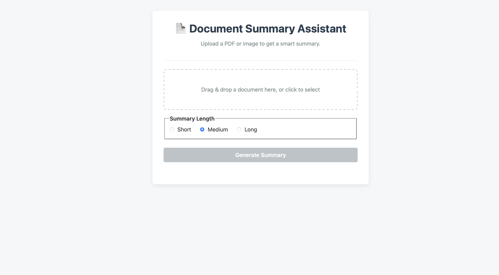

📄 Document Summary Assistant
A full-stack web application that takes any document (PDF/Image) and generates a smart, concise summary using the Google Gemini AI.

➡️ View Live Demo

## Project Description
The Document Summary Assistant is a tool designed to quickly extract and summarize text from various document formats. Users can upload a PDF or an image of a document (like a scanned page) and receive a short, medium, or long summary of its contents. This project leverages a React frontend for a dynamic user experience and a Node.js backend to handle file processing, text extraction, and communication with the Google Gemini API.

## ✨ Key Features
• Multi-Format Support: Upload and process both PDF and Image files (.png, .jpg).
• Drag-and-Drop Interface: A modern, intuitive interface for easy file uploads.
• Smart Summarization: Utilizes the Google Gemini API to generate high-quality, context-aware summaries.
• Variable Summary Length: Users can choose between short, medium, or long summaries to fit their needs.
• OCR for Images: Employs Tesseract.js to perform Optical Character Recognition on image-based documents.
• Responsive Design: A clean and fully responsive UI that works on both desktop and mobile devices.

## 📸 Application Demo

## 🛠️ Tech Stack
Frontend
• React.js (with Vite)
• Axios (for API communication)
• React Dropzone (for drag-and-drop functionality)
• CSS (for custom styling)

Backend
• Node.js
• Express.js (for the server and API routes)
• Multer (for handling file uploads)
• Google Gemini API (@google/generative-ai) (for AI-powered summarization)
• PDF-Parse (for extracting text from PDFs)
• Tesseract.js (for OCR on images)
• Dotenv (for managing environment variables)

## 🚀 Setup and Run Locally
To run this project on your local machine, follow these steps:

1. Prerequisites
• Node.js (v18 or later)
• npm
• A Google Gemini API Key

2. Clone the Repository
Bash

git clone https://github.com/Aviral2k/doc-summary-assistant.git
cd document-summary-assistant
3. Setup the Backend
Bash

# Navigate to the server directory
cd server

# Install dependencies
npm install

# Create a .env file in the /server directory
# and add your Gemini API key
Your server/.env file should look like this:

GEMINI_API_KEY=YOUR_API_KEY_HERE
Bash

# Start the backend server
npm start
The backend will be running on http://localhost:5000.

4. Setup the Frontend
Open a new terminal for the frontend.

Bash

# Navigate to the client directory from the root folder
cd client

# Install dependencies
npm install

# Start the React development server
npm run dev
The frontend will be running on http://localhost:5173 (or another available port). Open this URL in your browser to use the application.
